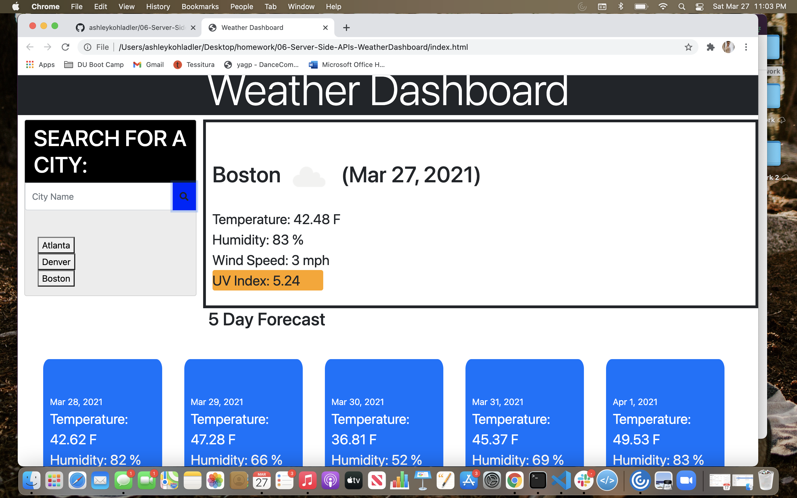

# 06-Server-Side-APIs-WeatherDashboard

# Homework 6

## Descritption of my work

* This is a Weather Dashboard for a traveler to be able to look up the weather for multiple cities so that they can plan a trip accordingly.

* When the user searches for a city, they are presented with current and future conditions for that city and that city is added to the search history.

* When the user views the current weather conditions for that city,
they are presented with the city name, the date, an icon representation of weather conditions, the temperature, the humidity, the wind speed, and the UV index.

* When the user views the UV index, they are presented with a color that indicates whether the conditions are favorable, moderate, or severe.

* When the user views the future weather conditions for that city,
they are presented with a 5-day forecast that displays the date, an icon representation of weather conditions, the temperature, and the humidity.

* When the user clicks on a city in the search history, they are again presented with current and future conditions for that city

## Link to Website -
 https://ashleykohladler.github.io/06-Server-Side-APIs-WeatherDashboard/

## Screenshot

